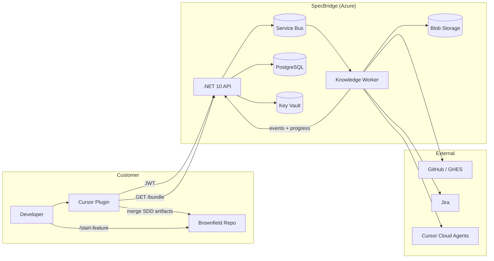
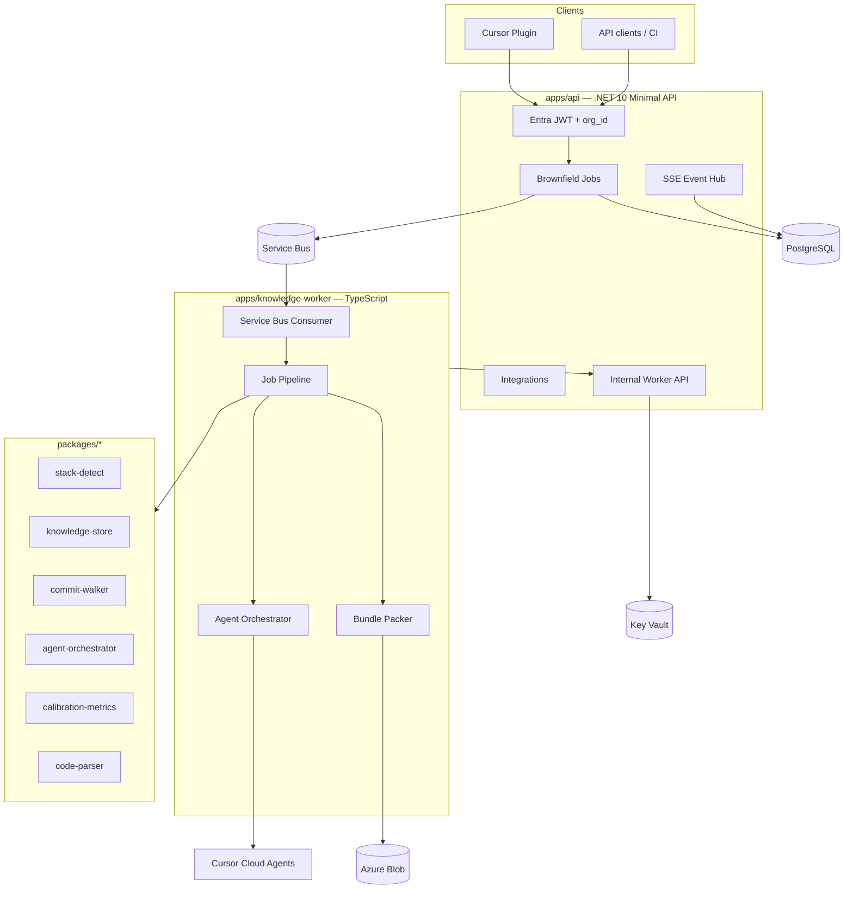
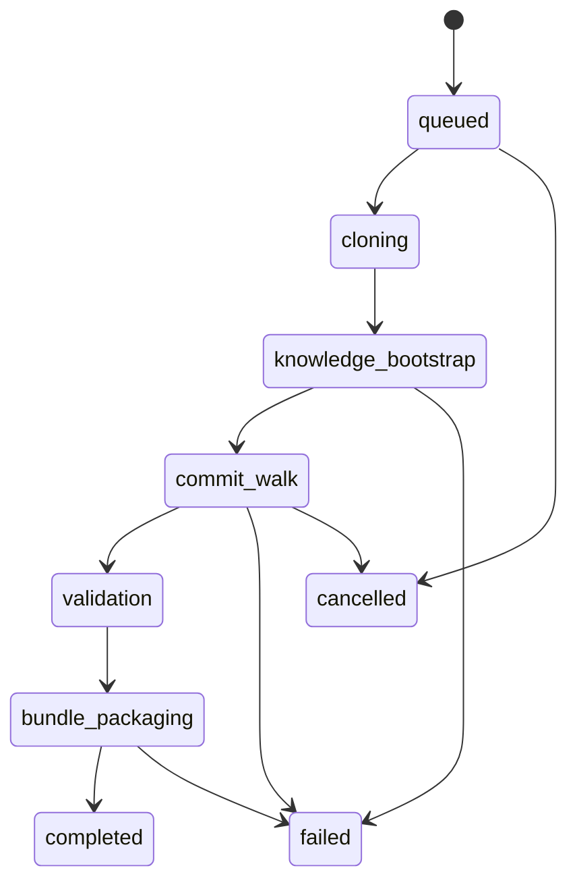
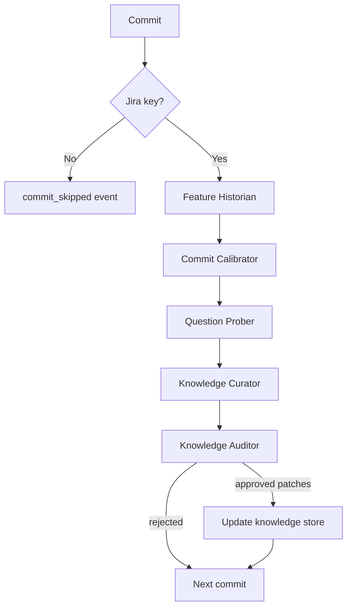

# SpecBridge

> Turn legacy repos into spec-driven codebases — one commit at a time.

SpecBridge is an Azure-hosted platform that makes any brownfield GitHub repository (any language, any framework) **SDD-ready**. It uses **Cursor Cloud Agents**, a **commit-history calibration loop**, and a **versioned knowledge bundle** consumed by a custom **Cursor plugin**.

**Status:** Customer-ready codebase — populate secrets at deploy time ([`docs/DEPLOYMENT.md`](docs/DEPLOYMENT.md)). No sensitive values are committed to git.

---

## Table of contents

- [Problem & solution](#problem--solution)
- [How it works](#how-it-works)
- [Architecture](#architecture)
- [Job pipeline](#job-pipeline)
- [Six agent roles](#six-agent-roles)
- [Bundle contents](#bundle-contents)
- [Quick start](#quick-start)
- [Documentation](#documentation)
- [Implementation plan](#implementation-plan)
- [Repository structure](#repository-structure)
- [Development](#development)
- [License](#license)

---

## Problem & solution

Brownfield teams struggle to adopt **Specs-Driven Design (SDD)** because:

1. **One-shot exploration** — tools re-explore the codebase every session, wasting tokens and producing inconsistent context.
2. **No quality feedback loop** — generated knowledge never improves from real commit history.
3. **Manual scaffold burden** — developers must hand-install SDD kits, truth docs, and agent config before `/start-feature` works.

**SpecBridge solves this** by running a deterministic worker that:

1. Bootstraps **council-v2 truth docs** and **tokenized knowledge shards** at repo HEAD.
2. Walks commit history, linking **Jira issues** to each meaningful change.
3. Runs **six specialized Cursor agents** per linked commit to calibrate and improve knowledge.
4. Delivers a **plugin-ready ZIP bundle** (or optional GitHub PR) with measurable quality metrics.

---

## How it works



**Typical journey:**

1. Admin deploys SpecBridge and registers org integrations (Cursor key, GitHub, Jira).
2. Developer starts a **brownfield job** from the Cursor plugin (or API).
3. Worker clones the repo, bootstraps knowledge, walks commits, runs agents.
4. Developer downloads the bundle; plugin merges `.cursor/`, `.sdd/`, and truth docs into the workspace.
5. Team uses standard SDD commands (`/council-v2`, `/start-feature`, `/start-story`) on real code.

Full plugin walkthrough: **[`docs/PLUGIN_USAGE.md`](docs/PLUGIN_USAGE.md)**.

---

## Architecture



| Component | Technology | Role |
|-----------|------------|------|
| **Public API** | .NET 10 Minimal API, Entra JWT | Job CRUD, SSE, integrations, bundle SAS redirect |
| **Knowledge worker** | TypeScript, `@cursor/sdk` | Clone repo, orchestrate agents, pack bundle |
| **Queue** | Azure Service Bus | Decouple API from long-running jobs |
| **Database** | PostgreSQL + EF Core | Jobs, connections, events, commit/phase audit |
| **Secrets** | Azure Key Vault | Cursor keys, GitHub tokens, Atlassian OAuth bundles |
| **Storage** | Azure Blob | Bundle ZIPs (30-min read SAS) |
| **Observability** | Application Insights + OpenTelemetry | Traces, metrics, structured logs |

**Security highlights:**

- Tenant isolation via JWT `org_id` and EF global query filters
- Secrets stored as Key Vault **names** in DB; values never logged
- Internal worker endpoints protected by `X-SpecBridge-Events-Key` (min 32 chars)
- Repo URLs limited to `github.com` + registered GHES hosts

Deploy configuration: [`docs/DEPLOYMENT.md`](docs/DEPLOYMENT.md).

---

## Job pipeline

Each brownfield job runs three major phases:



### Phase 1 — Knowledge bootstrap

At repo HEAD, the **Knowledge Architect** agent produces:

- `.sdd/docs/project_knowledge.md` (12-section council-v2 equivalent)
- `.sdd/docs/project_deployment_knowledge.md`
- `.sdd/knowledge/manifest.json` with baseline `tokenEstimateTotal`
- `.sdd/knowledge/shards/{granularity}/` per `granularityPrompt`

Supporting packages: `stack-detect`, `code-parser`, `knowledge-store`.

### Phase 2 — Commit walk

For each commit in history (up to `commitDepth`):



- Commits **without** a matching Jira key emit `commit_skipped`.
- Commits **with** a key run the full **5-agent calibration loop** (Feature Historian through Knowledge Auditor).
- Approved patches shrink or refine shards; token estimates improve over the walk.

### Phase 3 — Bundle packaging

The worker assembles `specbridge-bundle-{jobId}.zip`:

| Path | Contents |
|------|----------|
| `.cursor/` | Full csharp-sdd-starter-kit |
| `AGENTS.md`, `USAGE_GUIDE.md` | SDD entry points |
| `.sdd/docs/` | Truth docs |
| `.sdd/knowledge/` | Shards + manifest |
| `.sdd/features/completed/` | Retro `feature_spec.md` per Jira commit |
| `.sdd/reports/` | Token curve + QA metrics |
| `specbridge.manifest.json` | Plugin contract with SHA-256 checksums |

Optional: `delivery.openPr=true` opens a PR on branch `sdd/onboarding/{jobId}`.

---

## Six agent roles

| # | Role | Prompt | Output |
|---|------|--------|--------|
| 1 | **Knowledge Architect** | `prompts/agents/knowledge-architect.md` | Truth docs + initial shards |
| 2 | **Feature Historian** | `prompts/agents/feature-historian.md` | Retro `feature_spec.md` per commit |
| 3 | **Commit Calibrator** | `prompts/agents/commit-calibrator.md` | `calibration-report.json` |
| 4 | **Question Prober** | `prompts/agents/question-prober.md` | `questions.json` |
| 5 | **Knowledge Curator** | `prompts/agents/knowledge-curator.md` | `curation-proposal.json` |
| 6 | **Knowledge Auditor** | `prompts/agents/knowledge-auditor.md` | `audit-verdict.json` |

Each role uses a **separate** `Agent.create()` call with its own system prompt — sessions are never shared across roles.

---

## Bundle contents

See [`docs/examples/specbridge.manifest.example.json`](docs/examples/specbridge.manifest.example.json) and the JSON Schema at [`docs/schemas/specbridge.manifest.schema.json`](docs/schemas/specbridge.manifest.schema.json).

Example knowledge metrics after a successful job:

- `tokenEstimateStart`: 1,200,000 → `tokenEstimateEnd`: 680,000 (**43% reduction**)
- `meanQaScore`: 0.81
- `commitsProcessed`: 34 / `commitsSkipped`: 16

---

## Quick start

### For platform admins (deploy)

1. Provision Azure resources (Container Apps, PostgreSQL, Service Bus, Blob, Key Vault, Entra app).
2. Set environment variables per [`docs/DEPLOYMENT.md`](docs/DEPLOYMENT.md).
3. Deploy `apps/api` and `apps/knowledge-worker`.
4. Run EF migrations (automatic on API startup when PostgreSQL is configured).

### For developers (onboard a repo)

1. Install the **SpecBridge Cursor plugin** and sign in.
2. Register integrations (Cursor, GitHub, Jira) — see [Plugin usage § Step 2](docs/PLUGIN_USAGE.md#step-2--register-integrations-one-time-per-org).
3. Create a job from the plugin or `POST /v1/brownfield-jobs`.
4. Watch SSE events until `job_completed`.
5. Apply the bundle to your workspace.
6. Run `/council-v2 --refresh` then `/start-feature "…"`.

### For API testing

```bash
# Health (anonymous)
curl https://your-api/health

# Create job (requires Entra JWT)
curl -X POST https://your-api/v1/brownfield-jobs \
  -H "Authorization: Bearer $TOKEN" \
  -H "Content-Type: application/json" \
  -d @job-request.json
```

OpenAPI spec: [`docs/api.openapi.yaml`](docs/api.openapi.yaml) · Swagger UI at `/swagger` in Development.

---

## Documentation

| Document | Audience | Description |
|----------|----------|-------------|
| **[`docs/PLUGIN_USAGE.md`](docs/PLUGIN_USAGE.md)** | Developers | End-to-end plugin workflow, job options, troubleshooting |
| **[`docs/DEPLOYMENT.md`](docs/DEPLOYMENT.md)** | Admins | Env vars, Azure config, Atlassian OAuth |
| **[`docs/README.md`](docs/README.md)** | Integrators | OpenAPI, manifest schema, validation |
| **[`USAGE_GUIDE.md`](USAGE_GUIDE.md)** | SDD users | Greenfield/brownfield SDD kit workflow (vendored into bundles) |
| **[`AGENTS.md`](AGENTS.md)** | Contributors | SDD kit map, agents, commands for *building* SpecBridge |
| **[`apps/api/README.md`](apps/api/README.md)** | Backend devs | API implementation status |

---

## Implementation plan

SpecBridge was built in phased delivery (from product spec + engineering plan). Current codebase implements **Phases 0–10**.

| Phase | Scope | Status |
|-------|--------|--------|
| **0** | OpenAPI 3.1, manifest JSON Schema, fake worker | ✅ |
| **1** | .NET 10 API skeleton, Entra JWT, EF Core, health/Swagger | ✅ |
| **2** | `agent-orchestrator`, `stack-detect`, Knowledge Architect, bundle packer | ✅ |
| **3** | `commit-walker`, Jira client, Feature Historian | ✅ |
| **4** | Calibrator, Prober, Curator, Auditor, token curve report | ✅ |
| **5** | Service Bus, Bicep IaC, App Insights, PR delivery, Confluence | ✅ |
| **6** | Tree-sitter parsers, recorded agent mocks, GHES allowlist, audit sanitization | ✅ |
| **7** | FluentValidation DTOs, tenant credential checks, GET job by id | ✅ |
| **8** | SSE events, bundle/report endpoints, worker event relay | ✅ |
| **9** | EF migrations, blob SAS, integrations, SDD kits, job list | ✅ |
| **10** | Worker credential resolve, DB job progress, E2E recorded flow | ✅ |
| **Customer-ready** | Atlassian OAuth, tenant EF filters, 409 rules, git clone, safe config | ✅ |

### API surface (15 endpoints)

**Integrations (5):**

- `PUT /v1/integrations/cursor/credentials`
- `DELETE /v1/integrations/cursor/credentials/{id}`
- `POST /v1/integrations/github/install` · `GET /v1/integrations/github/connections`
- `POST /v1/integrations/jira/connect` · `POST /v1/integrations/confluence/connect`

**SDD kits (2):**

- `GET /v1/sdd-kits` · `GET /v1/sdd-kits/{kitId}`

**Brownfield jobs (8):**

- `GET /v1/preflight/repo`
- `POST /v1/brownfield-jobs` · `GET /v1/brownfield-jobs` · `GET /v1/brownfield-jobs/{id}`
- `GET /v1/brownfield-jobs/{id}/events` (SSE)
- `GET /v1/brownfield-jobs/{id}/bundle` · `GET /v1/brownfield-jobs/{id}/report`
- `POST /v1/brownfield-jobs/{id}/cancel`

**Internal (worker-only):**

- `POST /v1/internal/brownfield-jobs/{id}/events`
- `POST /v1/internal/worker/resolve-credentials`

### Non-goals (v1)

- Custom SDD templates beyond `csharp-sdd-starter-kit`
- Full retro backlog (`requirements.md`, `stories.md`, `plan.md`) for historical commits
- Local Cursor execution (Cloud Agents only)
- Hard failure on low calibration overlap (warning in report only)
- Upfront Cursor cost prediction

Product spec: [`.sdd/features/pending/specbridge-platform/feature_spec.md`](.sdd/features/pending/specbridge-platform/feature_spec.md).

---

## Repository structure

```
specbridge/
├── apps/
│   ├── api/                    # .NET 10 Minimal API (Entra, jobs, integrations)
│   └── knowledge-worker/       # Service Bus consumer + job pipeline
├── packages/
│   ├── agent-orchestrator/     # Cursor SDK agent runs + handoffs
│   ├── audit-log/              # Sanitized job audit events
│   ├── bundle-packer/          # ZIP + specbridge.manifest.json
│   ├── calibration-metrics/    # Overlap + QA scoring
│   ├── code-parser/            # Symbol extraction (py/java/go/ts)
│   ├── commit-walker/          # Git history + Jira key extraction
│   ├── confluence-client/
│   ├── github-client/
│   ├── jira-client/
│   ├── knowledge-store/        # Shards, manifest, token caps
│   └── stack-detect/           # Repo language/framework detection
├── prompts/agents/             # Six agent system prompts
├── docs/
│   ├── api.openapi.yaml
│   ├── DEPLOYMENT.md
│   ├── PLUGIN_USAGE.md         # ← Plugin guide
│   ├── schemas/
│   └── examples/
├── infra/bicep/                # Azure IaC
├── tests/                      # Vitest integration + E2E
└── .sdd/                       # SDD artifacts for SpecBridge itself
```

---

## Development

### Prerequisites

- Node.js 20+ · npm workspaces
- .NET 10 SDK
- PostgreSQL 15+ (optional for local API persistence)
- Docker (optional, for local PostgreSQL)

### Run tests

```bash
npm test                    # 78+ Vitest tests across packages
cd apps/api && dotnet run   # API on https://localhost:5001
cd apps/knowledge-worker && npm start   # Worker (needs Service Bus or recorded mode)
```

### SDD workflow for SpecBridge itself

This repo is dogfooded with the csharp-sdd-starter-kit. See [`AGENTS.md`](AGENTS.md) and [`USAGE_GUIDE.md`](USAGE_GUIDE.md) for `/start-feature`, `/start-story`, `/council-v2`.

---

## License

Proprietary
