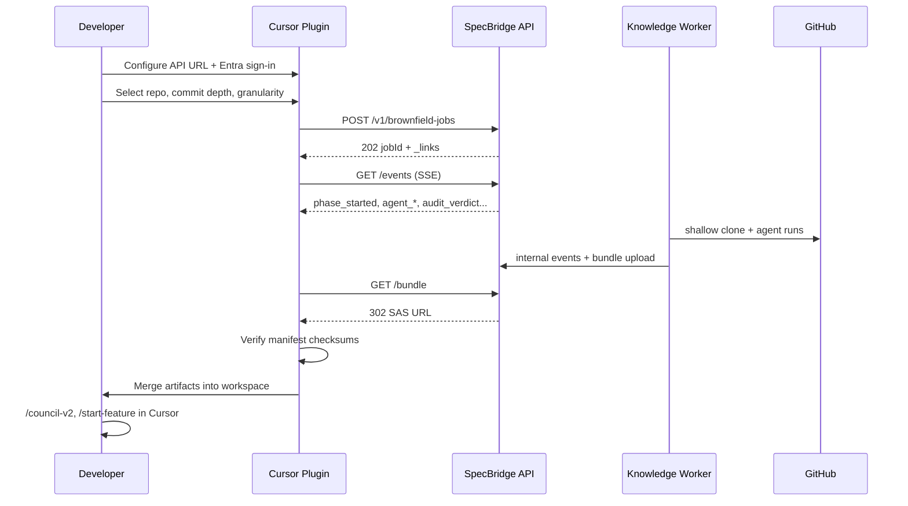

# SpecBridge Cursor Plugin — Usage Guide

> How to onboard a brownfield repository using SpecBridge and the custom Cursor plugin.

This guide is for **developers and platform admins** who run a completed SpecBridge job and want SDD-ready artifacts in their local Cursor workspace. It complements the API contract in [`api.openapi.yaml`](./api.openapi.yaml) and the bundle format in [`schemas/specbridge.manifest.schema.json`](./schemas/specbridge.manifest.schema.json).

---

## What the plugin does

The **SpecBridge Cursor plugin** (installed separately in Cursor) connects to your SpecBridge API, watches onboarding jobs, downloads the finished bundle, and **merges** SDD artifacts into your open workspace:

| Artifact | Purpose |
|----------|---------|
| `.cursor/` | Rules, agents, commands, skills (csharp-sdd-starter-kit) |
| `AGENTS.md`, `USAGE_GUIDE.md` | SDD entry points for humans and agents |
| `.sdd/docs/` | Truth docs (`project_knowledge.md`, `project_deployment_knowledge.md`) |
| `.sdd/knowledge/` | Tokenized shards + manifest for retrieval |
| `.sdd/features/completed/` | Retro feature specs per Jira-linked commit |
| `.sdd/reports/` | Quality report (token curve, QA scores) |
| `specbridge.manifest.json` | Plugin contract with SHA-256 checksums |

The plugin **never deletes** existing files in your workspace — it only adds or updates paths listed in the manifest.

---

## Prerequisites

1. **SpecBridge API** deployed and configured — see [`DEPLOYMENT.md`](./DEPLOYMENT.md).
2. **Entra ID** token with `org_id` claim for your organization.
3. **Integrations registered** for your org:
   - Cursor API key (`PUT /v1/integrations/cursor/credentials`)
   - GitHub connection (`POST /v1/integrations/github/install`)
   - Jira connection (`POST /v1/integrations/jira/connect`) — optional but recommended for commit walk
4. **SpecBridge Cursor plugin** installed in Cursor (your org’s plugin distribution channel).
5. **Brownfield repo** on `github.com` or an allowlisted GHES host.

---

## End-to-end flow



---

## Step 1 — Configure the plugin

1. Open **Cursor Settings → SpecBridge** (or your org’s plugin panel).
2. Set **API base URL** (e.g. `https://specbridge.contoso.com`).
3. Sign in with **Microsoft Entra ID** — the plugin obtains a JWT for API calls.
4. Confirm connectivity (health check or integration list).

Environment the plugin typically needs (set by admin or plugin config UI):

| Setting | Example |
|---------|---------|
| API base URL | `https://specbridge.contoso.com` |
| Entra tenant / client | From your app registration |

---

## Step 2 — Register integrations (one-time per org)

If not already done via admin portal or API:

```http
PUT /v1/integrations/cursor/credentials
Authorization: Bearer <token>
Content-Type: application/json

{ "name": "team-key", "apiKey": "<cursor-cloud-api-key>" }
```

```http
POST /v1/integrations/github/install
Authorization: Bearer <token>

{
  "hostType": "github.com",
  "webUrl": "https://github.com",
  "installationId": 12345678,
  "installationToken": "<optional-for-dev>"
}
```

```http
POST /v1/integrations/jira/connect
Authorization: Bearer <token>

{
  "code": "<oauth-authorization-code>",
  "redirectUri": "https://your-app/callback",
  "baseUrl": "https://yourorg.atlassian.net"
}
```

Store returned **connection IDs** — you need them when creating a job.

---

## Step 3 — Start an onboarding job

From the plugin UI or via API:

```http
POST /v1/brownfield-jobs
Authorization: Bearer <token>
Content-Type: application/json

{
  "repoUrl": "https://github.com/org/legacy-app",
  "defaultBranch": "main",
  "githubConnectionId": "<uuid>",
  "cursorCredentialId": "<uuid>",
  "sddKitId": "csharp-sdd-starter-kit",
  "history": {
    "commitDepth": 50,
    "walkOrder": "oldest_first"
  },
  "jira": {
    "connectionId": "<uuid>",
    "issueKeyPattern": "PROJ-\\d+",
    "extractFrom": ["commit_message", "branch_name"]
  },
  "knowledge": {
    "granularityPrompt": "tokenize_class",
    "advisorPrompt": "Focus on auth and data boundaries",
    "maxShardTokens": 800
  },
  "validation": {
    "devilsAdvocateQuestionCount": 10,
    "minAnswerScore": 0.75,
    "maxRoundsPerCommit": 1
  },
  "delivery": {
    "openPr": false
  }
}
```

**Response (202):** `jobId`, `status: queued`, and `_links` to `events`, `bundle`, `report`, `cancel`.

### Job options explained

| Field | Description |
|-------|-------------|
| `commitDepth` | Max commits to walk from HEAD |
| `walkOrder` | `oldest_first` (recommended) or `newest_first` |
| `granularityPrompt` | Shard size: `tokenize_file`, `tokenize_class`, `tokenize_namespace`, etc. |
| `advisorPrompt` | Steers Knowledge Architect focus areas |
| `issueKeyPattern` | Regex for Jira keys in commits/branches |
| `delivery.openPr` | If `true`, opens PR on `sdd/onboarding/{jobId}` branch |

---

## Step 4 — Monitor progress

### In the plugin

The plugin subscribes to **Server-Sent Events**:

```http
GET /v1/brownfield-jobs/{jobId}/events
Authorization: Bearer <token>
Accept: text/event-stream
```

Key event types:

| Event | Meaning |
|-------|---------|
| `phase_started` | `knowledge_bootstrap`, `commit_walk`, `bundle_packaging`, … |
| `agent_started` / `agent_completed` | Cursor Cloud Agent run for a role |
| `commit_skipped` | No Jira key on commit |
| `audit_verdict` | Knowledge Auditor approved/rejected patches |
| `bundle_ready` | ZIP available |
| `job_completed` / `job_failed` | Terminal state |

### Poll status

```http
GET /v1/brownfield-jobs/{jobId}
```

Shows `status`, `currentPhase`, `commitsProcessed`, token estimates, and optional `prUrl`.

---

## Step 5 — Download and apply the bundle

When status is `completed`:

1. Plugin calls `GET /v1/brownfield-jobs/{jobId}/bundle` → **302** to a **30-minute SAS URL**.
2. Plugin downloads `specbridge-bundle-{jobId}.zip`.
3. Plugin reads `specbridge.manifest.json` and verifies **SHA-256** for every file entry.
4. Plugin extracts into the **workspace root** using merge semantics (no destructive deletes).

### Manual download (without plugin UI)

```bash
# Obtain SAS URL from redirect
curl -sI -H "Authorization: Bearer $TOKEN" \
  "https://specbridge.contoso.com/v1/brownfield-jobs/$JOB_ID/bundle" \
  | grep -i location

# Download and inspect
curl -o bundle.zip "<sas-url>"
unzip -l bundle.zip | head
```

---

## Step 6 — Verify the workspace

After apply, your repo root should include:

```
your-repo/
├── .cursor/           # SDD kit (rules, agents, commands)
├── AGENTS.md
├── USAGE_GUIDE.md
├── .sdd/
│   ├── docs/
│   │   ├── project_knowledge.md
│   │   └── project_deployment_knowledge.md
│   ├── knowledge/
│   │   ├── manifest.json
│   │   └── shards/...
│   ├── features/completed/
│   │   └── PROJ-1234/feature_spec.md
│   └── reports/
│       └── onboarding-{jobId}.json
└── specbridge.manifest.json   # optional; plugin may omit from VCS
```

Open the folder in Cursor: **File → Open Folder** (`.cursor/` must be at project root).

---

## Step 7 — Use SDD in Cursor

With artifacts applied:

| Goal | Command / action |
|------|------------------|
| Refresh truth docs from code | `/council-v2 --refresh` |
| Ask architecture questions | `/council-v2 "How does auth work?"` |
| Start new feature (greenfield in brownfield repo) | `/start-feature "my feature"` |
| Implement a story | `/start-story <feature-id> <STORY-ID>` |
| Finish a story | `/finish-story <feature-id> <STORY-ID>` |

Read [`USAGE_GUIDE.md`](../USAGE_GUIDE.md) (vendored into your repo) for greenfield vs brownfield SDD patterns.

### Optional — PR delivery

If the job was created with `"delivery": { "openPr": true }`, check `prUrl` on the job or in `specbridge.manifest.json` → `pullRequest`. Review and merge the PR instead of (or in addition to) local plugin apply.

---

## Quality report

```http
GET /v1/brownfield-jobs/{jobId}/report
```

Example metrics:

- `tokenCurve` — per-commit token estimate and QA score
- `tokenEstimateStart` / `tokenEstimateEnd` / `tokenReduction`
- `meanQaScore`, `calibrationOverlapMean`
- `commitsProcessed`, `commitsSkipped`, `patchesApproved`, `patchesRejected`

Use this to decide if you need a deeper `commitDepth` or different `granularityPrompt` before re-running.

---

## Manifest contract

Every bundle includes `specbridge.manifest.json`. Validate against the schema:

```bash
npx ajv validate \
  -s docs/schemas/specbridge.manifest.schema.json \
  -d path/to/specbridge.manifest.json
```

Example structure: [`examples/specbridge.manifest.example.json`](./examples/specbridge.manifest.example.json).

The plugin uses manifest `files.*` entries to:

1. Verify integrity before merge
2. Show a summary UI (shard count, token reduction, kit version)
3. Skip unknown `specbridgeVersion` minor fields (forward-compatible)

---

## Troubleshooting

| Symptom | Likely cause | Action |
|---------|--------------|--------|
| `403` on job APIs | Missing/wrong `org_id` in JWT | Fix Entra app claims |
| `409` on create | Active job for same repo + branch | Wait or cancel existing job |
| `503` on Jira connect | Atlassian OAuth not configured | Set `SPECBRIDGE_Atlassian__ClientSecret` |
| SAS URL expired | 30-minute TTL | Call `GET /bundle` again |
| Checksum mismatch | Corrupt download | Re-download bundle |
| Empty commit walk | No Jira keys match pattern | Adjust `issueKeyPattern` or `extractFrom` |
| GHES clone fails | Cursor/worker egress blocked | Allowlist Cursor egress IPs on GHES |
| Plugin merge conflicts | Path already exists with edits | Resolve manually; plugin does not overwrite blindly |

---

## API reference

- OpenAPI: [`docs/api.openapi.yaml`](./api.openapi.yaml)
- Deployment: [`docs/DEPLOYMENT.md`](./DEPLOYMENT.md)
- Manifest schema: [`docs/schemas/specbridge.manifest.schema.json`](./schemas/specbridge.manifest.schema.json)

---

## Related docs

- [README](../README.md) — platform overview and architecture
- [USAGE_GUIDE.md](../USAGE_GUIDE.md) — SDD starter kit workflow (after bundle apply)
- [apps/api/README.md](../apps/api/README.md) — API implementation details
